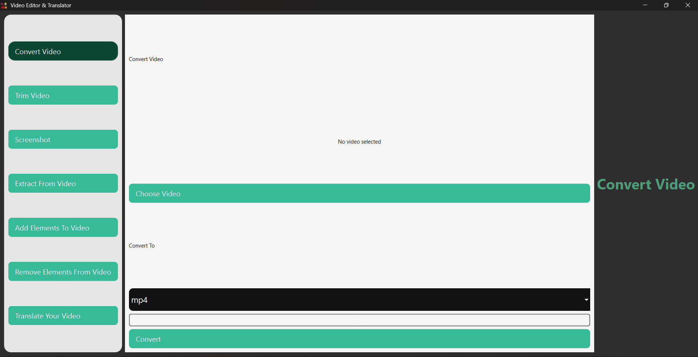
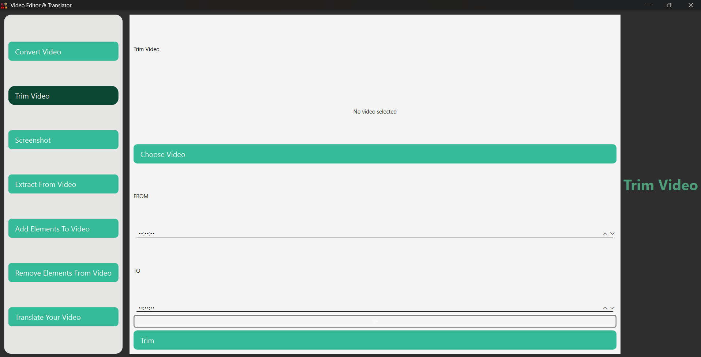
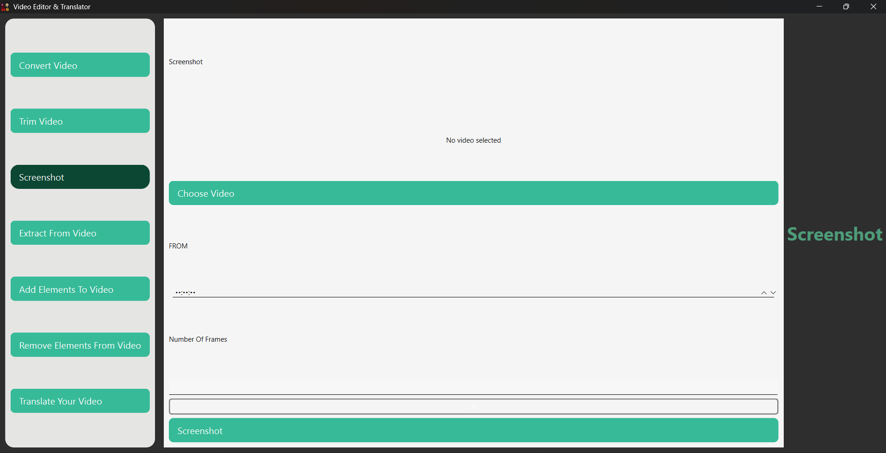
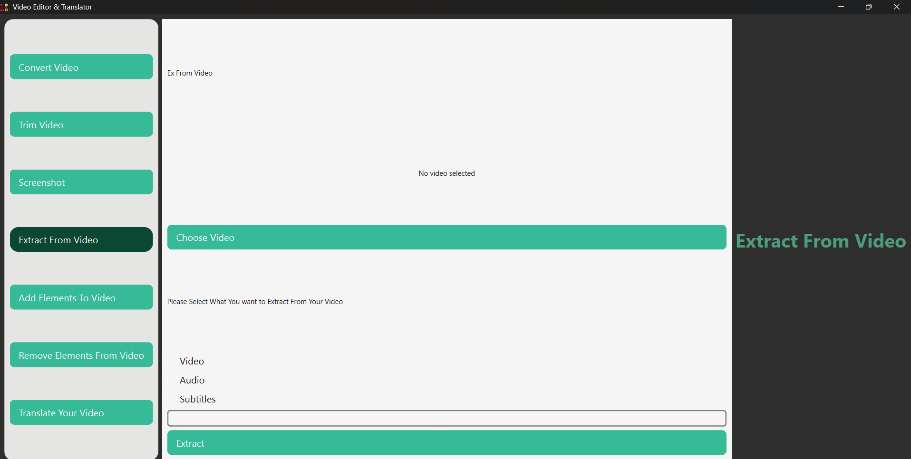
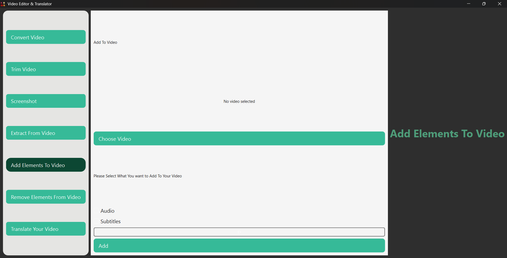
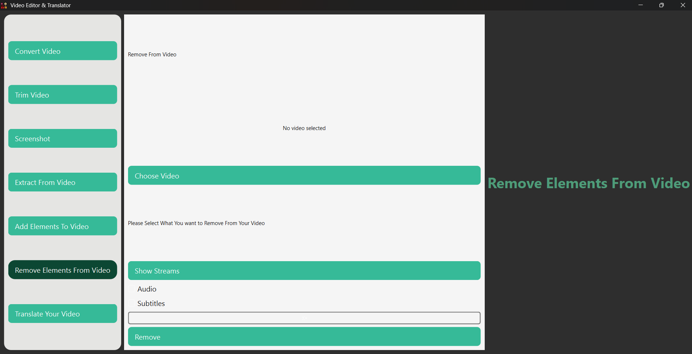
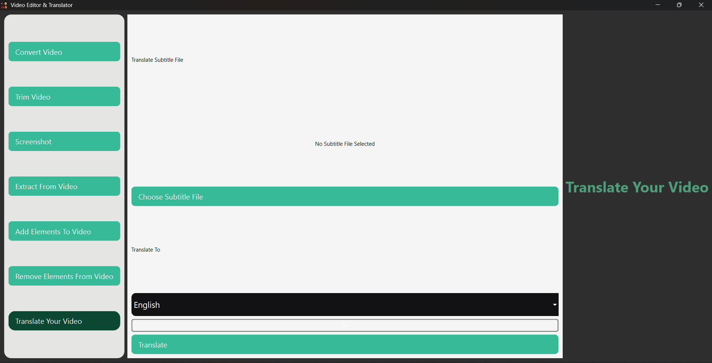

# VideoCraft Pro

## Overview
VideoCraft Pro is an all-in-one video editing and translation tool built using Python with PyQt6, FFmpeg, and Deep Translator libraries. This application simplifies the process of editing videos, extracting elements, adding subtitles, and translating content. Whether you're a casual user or a professional editor, VideoCraft Pro offers a user-friendly interface to enhance your video projects.

## Features

### 1. Convert Video
Easily convert videos between different formats. Select the input video, choose the desired output format (e.g., MP4), and click "Convert" to start the process.

### 2. Trim Video
Trim unwanted parts of your videos. Select the video, specify the start and end times, and click "Trim" to create a new, shortened version of the video.

### 3. Screenshot
Capture specific frames from your videos. Select the video, specify the frame number, and click "Screenshot" to save the image.

### 4. Extract From Video
Extract various elements from your videos such as audio tracks, subtitles, or even separate video streams. Select the video, choose the element you want to extract, and click "Extract."

### 5. Add Elements To Video
Enhance your videos by adding audio tracks or subtitles. Select the video, choose the element you want to add, and click "Add."

### 6. Remove Elements From Video
Clean up your videos by removing unnecessary elements like audio tracks or subtitles. Select the video, choose the element you want to remove, and click "Remove."

### 7. Translate Your Video
Translate the subtitles of your videos into different languages using advanced translation tools. Select the subtitle file, choose the target language, and click "Translate" to generate a new subtitle file in the selected language.

## Technology Stack
- **Programming Language**: Python
- **GUI Framework**: PyQt6
- **Video Processing**: FFmpeg
- **Translation Library**: Deep Translator (Google Translate API)

## Connect with Me
Feel free to reach out to me on social media for collaborations, feedback, or just to say hi! 😊

- **LinkedIn**: [Keroles Ramses](https://www.linkedin.com/in/keroles-ramses/)

## Conclusion
VideoCraft Pro is a user-friendly video editing and translation tool designed for casual users who want to enhance their videos or translate subtitles with ease. Whether you're trimming clips, adding subtitles, or translating content into different languages, VideoCraft Pro simplifies the process with its intuitive interface.
